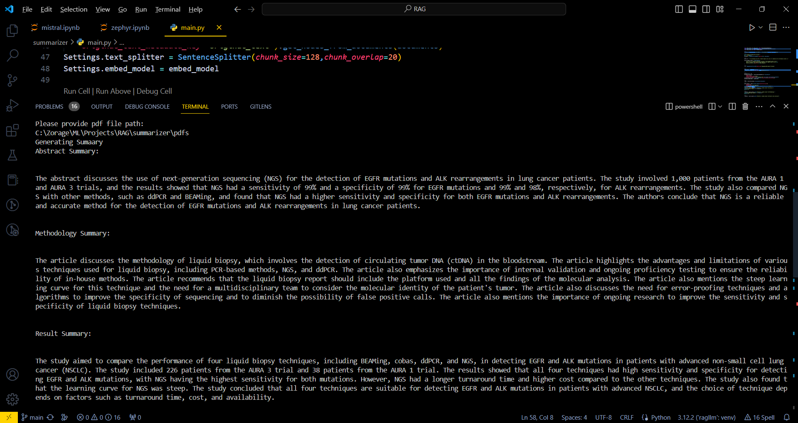

# Retrieval-Augmented-Generation

## Description
Welcome to the project, This is a  Retrieval-Augmented-Generation system made in Python and the LLama-index framework. It allows users to chats with a set of pds documents.

## Instructions
1. Fork this repository
2. Clone the forked repository
3. create a python virtual environment and activate it
4. run the requiremnt.txt to install all the required modules
5. Check if you have visual studio tools(build tools with desktop development c++ tools) and cpp compiler installed and running
6. Sign up on Hugging face to get your own token aand paste it in  hft_token to access hugging face modules
7. Add the pdfs to test pdfs folder
8. run the main.py file and wait (Depending on your device it may take some time to generate responses, please be patient)

## Building Process 

### Methodology
I have gone with RAG(Retrieval Augmented Generation) method instead of fine tuning techniques due to time and computation power limitation as well as, during fine tuning LLMs tends to forget knowledge outside of knowledge base that it is bweing fine tuned on resulting in low performance. 

### Open Source Resources Used:
The Large language model used, embeddings used and database used are all open source so anybody can easily run the model on their system.if you wish to use other llms you are free to go thorugh the llama index documentation.

### Resources:
1. LLM : Mistral 7B ggml model, Zephyr (fine Tuned mistral 7b)
2. Embeddings : Hugging Face BAAI bge base
3. Database : ChromaDB and inbuilt vector db of llama index 

## Results

